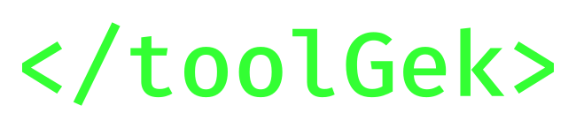

<div align="center">

  <a href="https://toolgek.com">
    
  </a>

</div>

<div align="center">

  

</div>

# @toolgek/tools

`@toolgek/tools` is an open-source, self-describing collection of JavaScript tool packages.

Each tool package brings together everything needed to define, execute, present, and document a tool. This includes its implementation, machine-readable definition, page information, and long-form content.

[toolgek.com](https://toolgek.com) is the public Toolgek platform that consumes these packages and makes the tools available through the web.

> [!WARNING]
> **`@toolgek/tools` is currently in alpha and under active development. The structure, content, APIs, and package formats may change without notice.**

## What is Toolgek?

[toolgek.com](https://toolgek.com) is a collection of simple, fast, browser-based developer utilities for tasks such as text transformation, encoding, validation, and other everyday development work.

The tools are designed to execute locally in the browser. Tool inputs are processed on the client rather than being sent to a Toolgek server.

The Toolgek project is split between two repositories with different responsibilities:

```text
@toolgek/tools
       │
       │ contains
       ▼
  Tool Packages
       │
       ├── can be inspected
       ├── can be used or adapted
       ├── can be consumed by applications
       │
       │ consumed by
       ▼
  @toolgek/app
       │
       │ presents
       ▼
  toolgek.com
```

This repository contains the open-source tools themselves. The Toolgek application provides the platform, runtime, shared interface, and other functionality required to load and present them.

## Tool packages

Each directory in this repository represents a **tool package**.

A tool package is a self-contained collection of files that defines, implements, presents, and documents a tool.

For example:

```text
slugify/
├── manifest.js
├── tool.js
├── page.js
└── content.mdx
```

The files in a package each have a different responsibility. Keeping these pieces together makes each tool package self-contained, understandable, and independently versionable.

### `manifest.js`

The tool's machine-readable definition.

The manifest describes information such as the tool's ID, version, UI, inputs, actions, and outputs.

The Toolgek platform uses the manifest to understand how the tool should be loaded and presented without needing to know the details of its implementation.

### `tool.js`

The tool's implementation.

This contains the JavaScript logic that accepts input and produces the tool's result.

### `page.js`

Information used to define the tool's page.

This contains page-level metadata and information that is separate from the tool's runtime implementation.

### `content.mdx`

Long-form content associated with the tool.

This provides educational and informational material about the tool, including explanations of what it does, how it works, and related concepts.

## Using the Repository

`@toolgek/tools` is structured as a collection of self-contained packages rather than as a traditional library with a single public API.

The repository can be used at whatever level is useful. An individual implementation file can be used directly, a complete tool package can be copied or adapted, or the repository can be consumed as a collection by another application.

For example, `tool.js` can be used as ordinary JavaScript, while the accompanying manifest and page files can be used by another system to build its own interface or documentation around the tool.

The Toolgek platform currently consumes the repository as an npm dependency through Git:

```json
{
  "dependencies": {
    "@toolgek/tools": "github:toolgek/tools#<commit>"
  }
}
```

The platform pins a specific commit so that the set of available tools is reproducible.

After installation, the platform discovers the tool packages and uses their manifests, implementations, page information, and content as required.

## Versioning

Tool packages and the repository have separate version numbers with different purposes.

### Tool package versions

Each tool package has its own version defined in its `manifest.js`.

The package version describes changes to that individual tool.

### Repository versions

The `@toolgek/tools` repository also has its own version. The repository version describes releases of the collection as a whole.

The current versioning policy is:

* **Patch releases** — changes to existing tools that do not introduce a breaking change to the repository structure or package format.
* **Minor releases** — new tools or significant additions to the collection.
* **Major releases** — breaking changes to the repository structure, package format, or other changes that require consumers to adapt.

Individual tool versions can therefore change independently of the repository's release version while the repository version tracks the evolution of the collection.

## Why This Repository Exists

The Toolgek application and its tools have different responsibilities.

The application provides:

* Tool discovery
* Loading and runtime execution
* The shared user interface
* Navigation and page structure
* Common platform functionality

This repository provides:

* Individual tool implementations
* Tool definitions and manifests
* Tool page information
* Educational and informational content
* Versioned tool packages

Keeping these responsibilities separate allows the platform and the tools to evolve independently.

### Why is it open source?

The tools used by [toolgek.com](https://toolgek.com) are published here so that their implementations are visible rather than hidden behind the website.

Anyone can inspect the code and content, make their own assessment of how the tools work, use the repository as a learning resource, or adapt individual files and packages for their own projects.

Publishing the tools also allows the project to contribute useful implementations and educational material to the broader developer community.

## Development

Toolgek is currently developed internally.

The repository does not currently accept external pull requests or development contributions.

## License

This repository is licensed under the [Mozilla Public License 2.0 (MPL-2.0)](https://www.mozilla.org/en-US/MPL/2.0/).

The MPL is a file-level copyleft license. In general, modified MPL-covered files remain subject to the MPL when distributed, while larger works containing those files may be distributed under different terms, subject to the license's requirements.

This allows the tools in this repository to be incorporated into larger applications without requiring the entire application to be distributed under the MPL. Changes to MPL-covered files remain subject to the license.